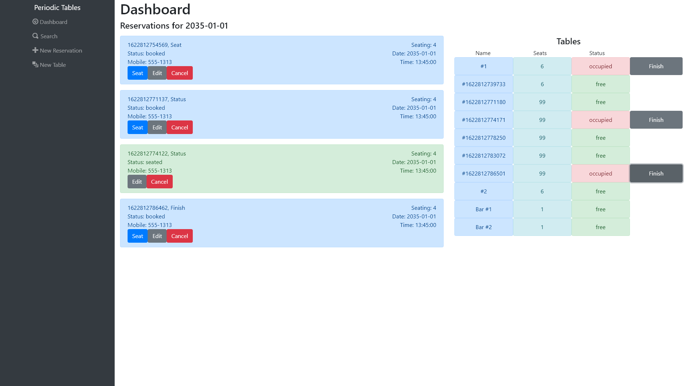
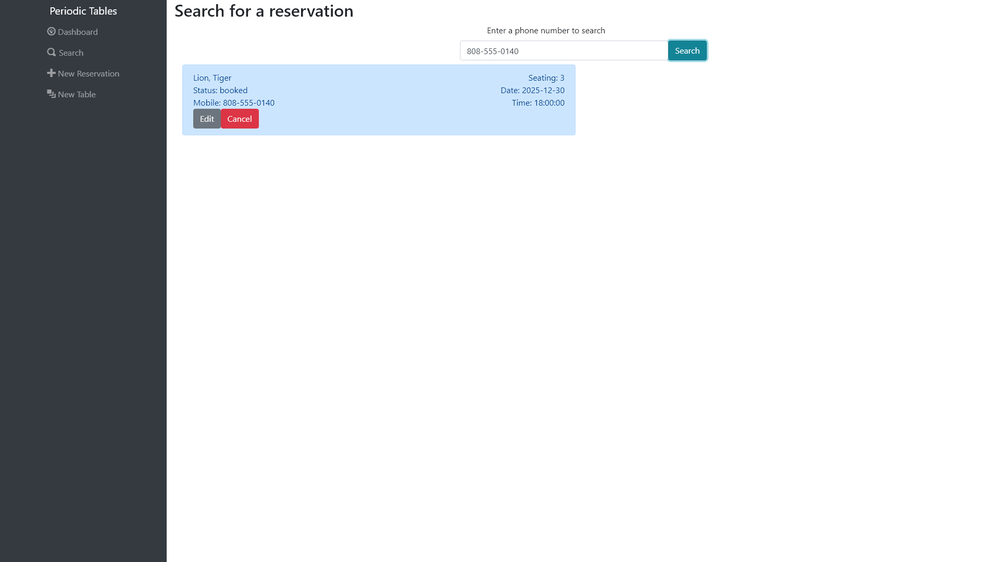
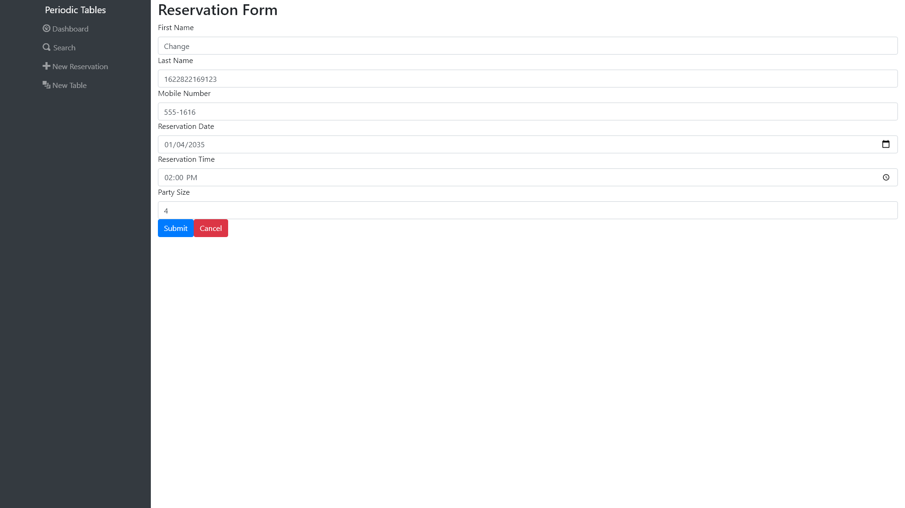
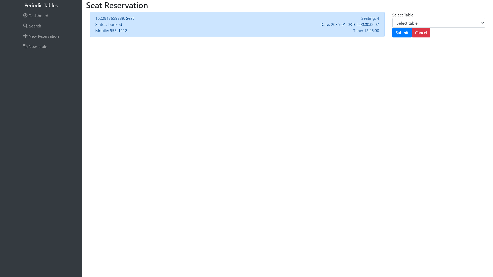
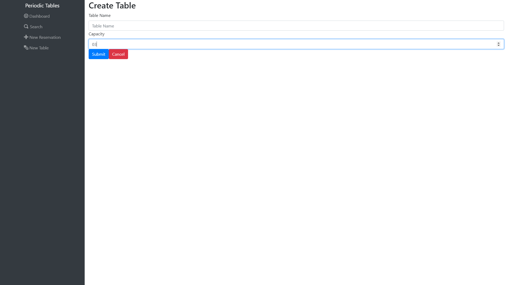

# James Jackson - Periodic Tables

This is my final project with Thinkful, it was created with React, Express, PostgreSQL, and Node.js. Periodic tables mimics some of the functionality of a restaurant's POS, allowing the user to create, edit, seat, and search for reservations as well as creating, monitoring, and updating tables and their occupancy status. 

# Front End - React

## `/dashboard` And `/dashboard?date=YYYY-MM-DD`

These routes go to the dashboard, which dispalys the reservations for a specific date that aren't `completed`, defaulting to the current date. From here, the user may monitor, `seat`, `edit`, and `cancel` reservations, and they may monitor the tables and `finish` tables to make them free.

### `DashBoard`



## `/search`

This route allows the user to search for orders by their mobile number.

### Search



## `/reservations/new`

This route allows the user to create a new reservation by filling out a form, there are validations on both the front end and the back end to ensure that the data provided is valid, complete, and formatted correctly. On successful submission, it makes a `POST` request to the API to create a reservation then redirects to /dashboard`/reservation-date`

## `/reservations/:reservation_id/edit`

This route is called by clicking `edit` on an existing reservation and uses the same form as above, but sets the fields to the data of the reservation in question. It displays the same behavior as above, except it makes a `PUT` request to update the reservation instead of a `POST` request.

### Reservation Form



## `/reservations/:reservation_id/seat`

This route is called by clicking `seat` on an existing reservation and displays a form seat a reservation at a table. On successful submittion, it sends a `PUT` request to the API to update the statuses of the table and the reservation, then redirects to dashboard.



## `/tables/new`

This route displays a form to create a new table. On successful submission it will send a `POST` request to the API to create a new table, then redirect to the dashboard.



# API Documentation

## `/reservations`

<hr>

### GET: `?date=YYYY-MM-DD`

Returns an array of all reservations made for that date.

### GET: `?mobile_number={some-number}`

Returns an array of all reservations with mobile numbers that are at least partial matches.

<i>Example of a response using the GET methods:</i>

```
[
  {
    reservation_id: 1,
    first_name: "Rick",
    last_name: "Sanchez",
    mobile_number: "202-555-0164",
    reservation_date: "2020-12-31",
    reservation_time: "20:00:00",
    people: 6,
    status: "booked"
  }
]
```

### POST

Creates and returns a new reservation in the database. Request needs a body.

<i>Example of a request using the POST method:</i>

```
request: {
    body: {
        data: {
            first_name: "Rick",
            last_name: "Sanchez",
            mobile_number: "202-555-0164",
            reservation_date: "2020-12-31",
            reservation_time: "20:00",
            people: 6,
            status: "booked"
        }
    }
}
```

- All fields shown above aside from status must be included.
- Mobile number formated as `xxx-xxxx` or `xxx-xxx-xxxx`.
- Date formated as YYYY-MM-DD, and must both be the current date or a future date and not a Tuesday (restaurant is closed on Tuesday)
- Time formatted as HH:MM in 24-hour time and if the date is the current date, the time must not be in the past.
- People must be a number and greater than 0.

Returns status 201 and the created reservation object.<br><br>

## `/reservations/:reservation_id`

<hr>

### GET

Returns requested reservation if it exists.

<i>Example of the return using the GET method:</i>

```
{
    reservation_id: 1,
    first_name: "Rick",
    last_name: "Sanchez",
    mobile_number: "202-555-0164",
    reservation_date: "2020-12-31",
    reservation_time: "20:00:00",
    people: 6,
    status: "booked"
}
```

### PUT

Request needs a body and formated the same as POST `/reservations`

<i>Example of a request using the PUT method:</i>

```
request: {
    body: {
        data: {
            first_name: "Rick",
            last_name: "Sanchez",
            mobile_number: "202-555-0164",
            reservation_date: "2020-12-31",
            reservation_time: "20:00",
            people: 6,
            status: "booked"
        }
    }
}
```
Returns status 200 and the updated reservation.<br><br>

## `/reservations/:reservation_id/status`

<hr>

### PUT

Requires a body with status propery in the data, and updates the status of the reservation.

Returns status 200 and the updated reservation object.

<br><br>

## `/tables`

<hr>

### GET

Returns an array of all tables in the database.

<i>Example of a response using the GET method:</i>

```
[
  {
    table_id: 1,
    table_name: "#1",
    capacity: 6,
    reservation_id: null
  }
]
```

### POST

Creates and returns a new table. Request requires a body.

<i>Example of a request using the POST method:</i>

```
request: {
    body: {
         data : {
              table_name: "#7",
              capacity: 6,
              reservation_id: 12
        }
    }
}

```

- table_name must be at least 2 characters.
- capacity must be a number and greater than 0.
- reservation_id must reference an existing reservation if it is provided, otherwise it defaults to null.

Returns 201 and the created table.
<br><br>

## `/tables/:table_id`

<hr>

### GET

Returns the specified table, if it exists.

<i>Example of a response using the GET method:</i>

```
data: {
    table_id: 12,
    table_name: "Bar #4",
    capacity: 3,
    reservation_id: null
}
```

<br>

## `/tables/:table_id/seat`

<hr>

### PUT

If the table exists and is `free`and the reservation exists and is `booked`, the table will be updated with the reservation_id passed. The status of the reservation is then updated to `seated`. 

Returns status 200 and the updated reservation.


### DELETE

If the table exists and is occupied, set the the status of the reservation currently seated to `finished`, and the status of the table to `null`. 

Returns status 200 and the updated reservation

<br>

# Installation Instructions

In order to effectively install and use this application locally, you will need to either clone the repo or download the zip. You will then need to navigate to the top level of the project in your bash terminal and:

1. run `npm i`
2. `cd front-end && npm i`
3. `cd ../back-end && npm i`

Now that you have all of the scripts installed, you will need two different PostgreSQL database instances to either run the application locally or test it.

You must make a `.env` file in both the front-end and back-end directories.

Load the back-end `.env` file with two environment variables with the values of your two database URLs like so:

```
DATABASE_URL_DEVELOPMENT=development-data-base-url-goes-here
DATABASE_URL_TEST=test-data-base-url-goes-here
```

In the front-end `.env` file, enter:

```
REACT_APP_API_BASE_URL=http://localhost:5000
```

Now you will need to migrate the tables to the development database. Don't bother doing it for the test database, though. The tests are carrying that out for you each time. From the back-end folder:

1. `npx knex migrate:latest`
2. `npx knex seed:run`

Now you are ready to run the server locally. From the top level of the project, run `npm run start:dev` if you would like to run the server and application.

If you would like to test the application, you can view the `package.json` files and use the testing scripts provided there. Unfortunately, some of the provided testing scripts do not function. However, the ones that certainly do are:

1. all of those that are structured like `test:5:backend` or `test:3:frontend`
2. `test:frontend` and `test:backend`
